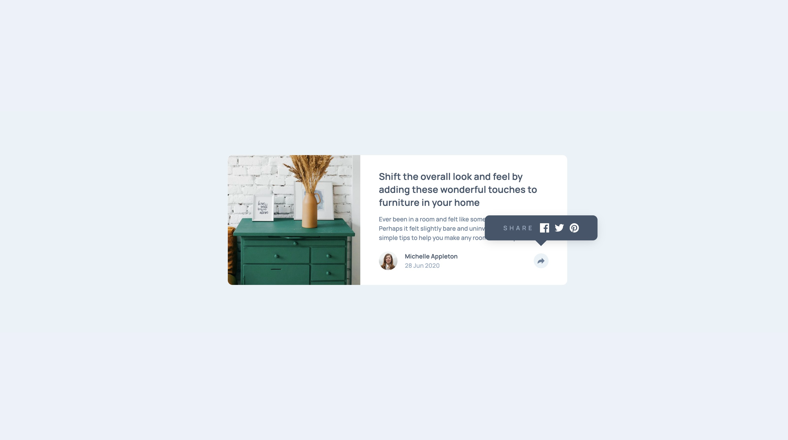

# Frontend Mentor - Article preview component solution

## Overview

### The challenge

Users should be able to:

- View the optimal layout for the component depending on their device's screen size
- See the social media share links when they click the share icon

### Screenshot

### Links

- Solution URL: [https://github.com/metinahmeterkeles/Article-preview-component](https://github.com/metinahmeterkeles/Article-preview-component)
- Live Site URL: [https://melodious-fenglisu-551949.netlify.app/](https://melodious-fenglisu-551949.netlify.app/)
